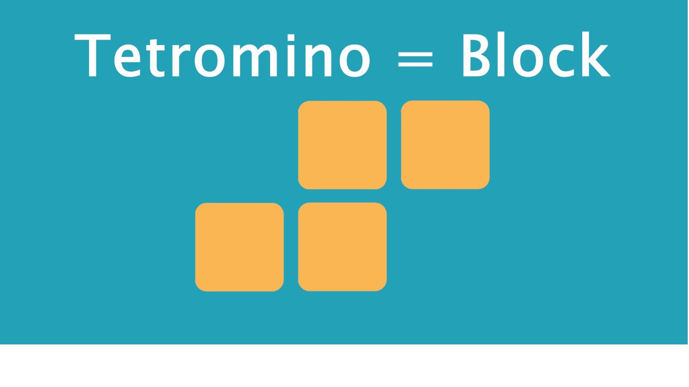
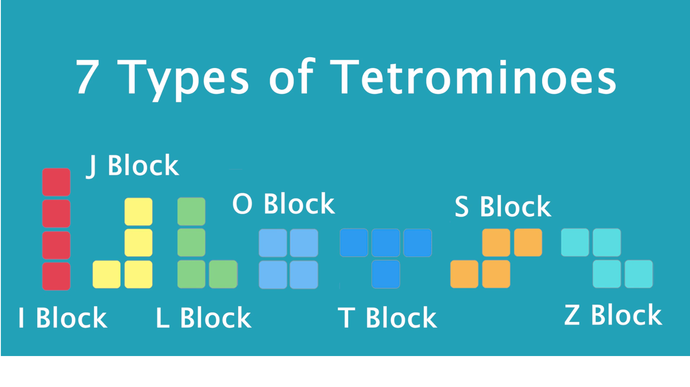

# Tetris_Game_In_Flutter
 
 In this I show you that how can we make Tetris Game in Flutter. In this game we play tile matching.
 
 With the help of below widgets and package we make Tetris game in Flutter.
 + SafeArea 
 + Flexible
 + LinearGradient
 + DecorationBox
 + SizedBox
 + Getter and Setter
 + Global key
 + Stack
 + Positioned
 + RenderBox
 + Provider package

